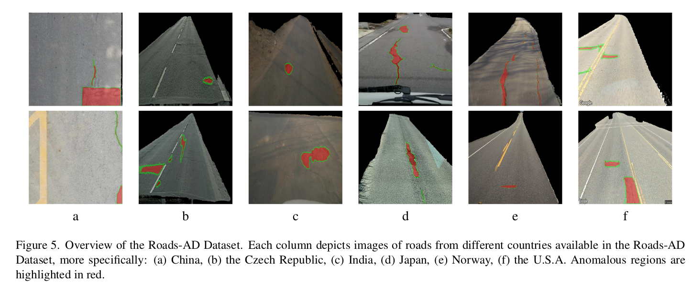
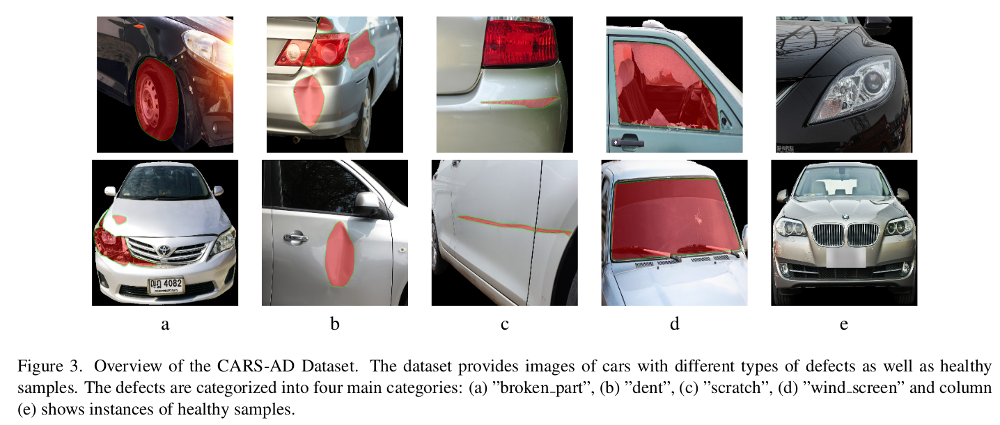

# Heterogeneous Datasets for Unsupervised Image Anomaly DetectionWACV 2025)

Welcome to the official repository for **CARS-AD** and **ROADS-AD**, two novel datasets designed to advance research in **unsupervised anomaly detection (AD)**. These datasets were introduced in our work accepted for presentation at **WACV 2025**:

> **"Challenging Heterogeneous Datasets for Unsupervised Anomaly Detection"**  
> *Juan B., et al., Accepted for WACV 2025*

---

## 📖 Abstract

Unsupervised anomaly detection (AD) plays a critical role in domains such as manufacturing and infrastructure monitoring. In this work, we present **CARS-AD** and **ROADS-AD**, two challenging datasets with diverse, heterogeneous image content to evaluate AD algorithms rigorously.

- **CARS-AD**: Real images of cars exhibiting various defects.  
- **ROADS-AD**: Images of roads from multiple countries, presenting unique challenges for anomaly detection.

Both datasets include:  
- **Pixel-wise ground truth masks** for anomaly localization.  
- **Image-level labels** for anomaly detection benchmarking.  

We evaluate state-of-the-art unsupervised AD methods using the **AUROC metric** for detection and localization. Our results reveal significant room for improvement, emphasizing the need for robust and adaptable AD techniques.  

For more details, the paper will be available after publication. Stay tuned!

---

## 📂 Dataset Overview

### 1. **CARS-AD**
- **Domain**: Vehicle defect detection.  
- **Content**: High-resolution images of cars with various types of defects.  
- **Annotations**:  
  - Pixel-wise masks for anomalies.  
  - Image-level anomaly labels.  

### 2. **ROADS-AD**
- **Domain**: Infrastructure monitoring.  
- **Content**: Images of roads from diverse geographic regions with unique anomalies.  
- **Annotations**:  
  - Pixel-wise masks for anomalies.  
  - Image-level anomaly labels.  

### Key Features
- Diverse, heterogeneous content for challenging AD tasks.  
- Ground truth annotations for detailed evaluation and benchmarking.  

### Dataset Overview

##ROADS-AD

##CARS-AD

---

## 📊 Benchmark Results

| Dataset  | Method               | AUROC (Detection) | AUROC (Localization) |
|----------|----------------------|-------------------|-----------------------|
| CARS-AD  | CsFlow, U-Flow       | High              | Moderate             |
| ROADS-AD | Reverse Distillation | Moderate          | High                 |

Our results demonstrate the need for nuanced and robust AD methods to handle the complexity of real-world anomalies.

---

## 📦 Download the Datasets

The datasets are available for download via the following links:  

- [**CARS-AD** Dataset](https://github.com/juanb09111/heterogeneousAD)  
- [**ROADS-AD** Dataset](https://github.com/juanb09111/heterogeneousAD)  

---

